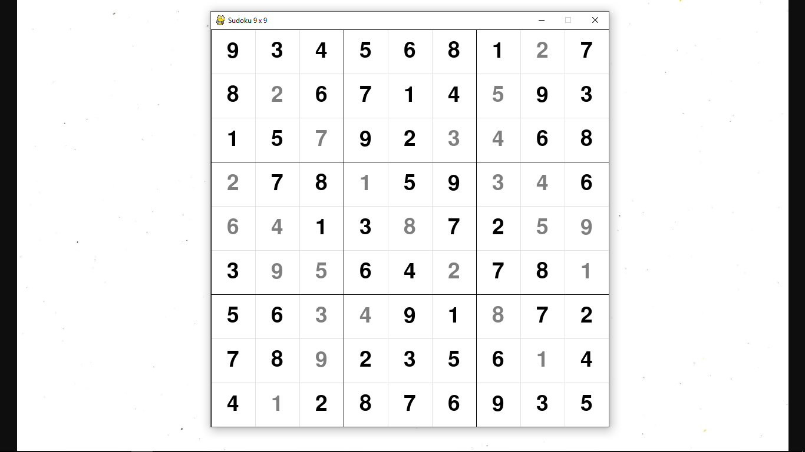

# Creating and Solving Variations on Sudoku Puzzles



## Set up

```bash
python -m venv env
pip install -r requirements.txt
```

## Example Usage

### Sudoku Puzzle Solver

```bash
python solve.py -l data/classic/example.sdk
```

### Sudoku Puzzle Generator

```bash
python generate.py -l data/classic/example.sdk -s data/classic/example_tran
sposed.sdk -f -m transpose
```

## Available Options

### Sudoku Puzzle Solver

    usage: solve.py [-h] -l LOAD [-s SAVE] [-f] [-d]

    Solving Variations on Sudoku Puzzles

    optional arguments:
    -h, --help            show this help message and exit
    -l LOAD, --load LOAD  a file representing an unsolved sudoku problem
    -s SAVE, --save SAVE  where to save the linear programming formulation of
                            the given problem
    -f, --force           do not prompt before overwriting
    -d, --debug           enable debugging mode

### Sudoku Puzzle Generator

    usage: generate.py [-h] -l LOAD -s SAVE -m METHOD [-f]

    Creating Variations on Sudoku Puzzles

    optional arguments:
    -h, --help            show this help message and exit
    -l LOAD, --load LOAD  a file representing an unsolved sudoku puzzle
    -s SAVE, --save SAVE  the name of the new sudoku puzzle
    -m METHOD, --method METHOD
                            the method used to create the new sudoku puzzle
    -f, --force           do not prompt before overwriting
